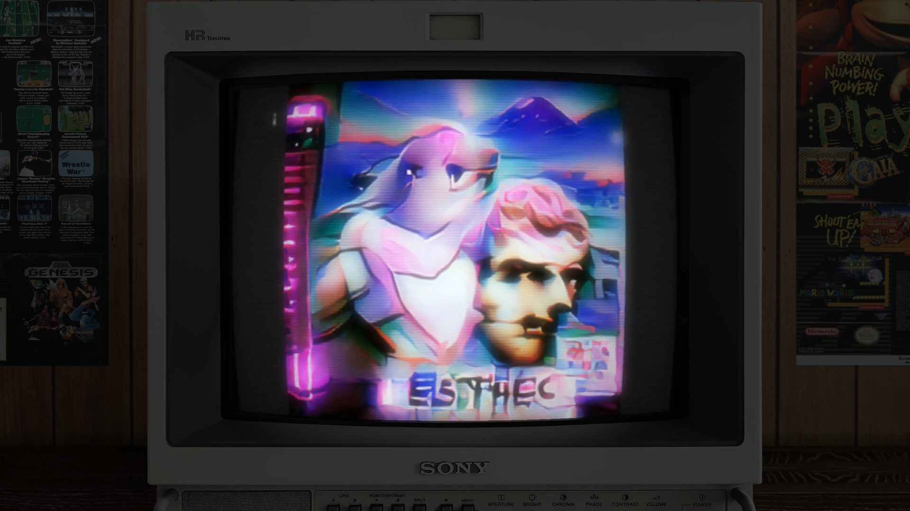

<h1 align="center">CRT Simulator:<br>Apply a fully automated "old CRT monitor" effect to any video.</h1>

[](https://www.youtube.com/watch?v=kym5vjTPEow)
<a target="_blank" href="https://www.youtube.com/watch?v=kym5vjTPEow"><p align="center">Click for Video</p></a>

## Using
- Pick a video. 
- Pick some audio.
- Edit the "options" section at the top of [automate.bash](https://github.com/ExamDay/CRT_Simulator/blob/master/automate.bash) to show the program where those files are.
- Run automate.bash (You'll need to switch to your virtual environment first if you weren't a [bad enough dude](https://www.youtube.com/watch?v=2evKkHi_qmo) to skip that step.)
```bash
cd /path/to/this/repository
bash automate.bash
```
And that's it! The edited video will appear in an "outputs" folder at the root of the repo.

# Some pointers:
- The aspect ratio of the included CRT overlay is 4:3. Any video differing from this ratio will be
  padded with an appropriate off-black to fit.
- If you want a different overlay (different monitor or background image) you can just swap out the
  image, but beware, as things are now you'll need to mess with the code a bit if the screen
  dimensions and position do not match the original.
- Future work should include an option to specify the dimensions and center of the video relative to
  the overlay for easy use with custom images. I'll get around to that eventually if no one else
  does.
- I welcome recommendations for new features and fixes!

## Installing (linux only for now)
- Install FFMPEG
```bash
sudo apt-get install ffmpeg
```

- Clone this repository wherever you want

- Create vitual environment and active it (if you're radical like me and addicted to danger you can skip this step)
```bash
cd /path/to/this/repository
python3 -m venv venv
source venv/bin/activate
```
- Install the requirements
```
pip3 install -r requirements.txt
```
That's it!

## Contributing
For contributors to the project; do this before making your first commit:

- Install pre-commit
```bash
cd /path/to/this/repository/
sudo apt install pre-commit
pre-commit install
```
(we do all of our development on linux for now)

- To test updates to the readme and other GitHub flavored markdown, simply install Grip
and feed it your desired file.
```bash
pip3 install grip
python3 -m grip README.md
```
- Then follow the link provided by the Grip sever for a live preview of your work.

- When satisfied with your changes you can compile to an html file with:
```bash
python3 -m grip README.md --export README.html
```

## Authors
* **Gabe M. LaFond** - *Initial work* - [ExamDay](https://github.com/ExamDay)

See also the list of [contributors](https://github.com/ExamDay/CRT_Simulator/contributors) who participated in this project.

## License
This project is licensed under the MIT License - see the [LICENSE.md](LICENSE.md) file for details
